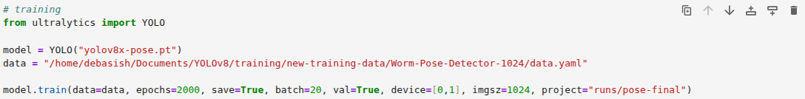

# Deep-Pose-Tracker

This repository contains scripts for Deep-Pose-Tracker (DPT), a deep learning model for real-time pose detection of *C. elegans*.

<!--

    
   

  
  

-->

 <!-- Row 1 -->    

<!-- Row 2 -->     

<!--   -->

## Model features

The model is composed of the following features:

1. Real-time pose detection
2. Quantification of eigenworms
3. Worm tracking and speed measurement
4. Area measurement
5. Orientation of motion detection
6. Detecting forward-reverse movement
7. Detecting omega turns
8. Multi-class detection and counting

**Note:** 
1. All the codes are optimized such that they can be used for a single worm as well as multiple worms.
2. The codes work on videos as well as images (wherever applicable).
3. You can keep multiple files in a folder, and give the folder path as input. That will work as well.
4. All the analysis results will be saved inside the `outputs` folder. For example, if you are running the `pose.ipynb` file on some video, the outputs will be saved in the `outputs/pose/run1` folder. If you run this file several times, respective outputs will be saved in `run2`, `run3`, ... inside the main `outputs/pose` folder.

## Repository Structure
The repository consists of the following files-
1. All the codes for the analysis of different behavioural features.
2. Pretrained weights for pose detection, detection of worms and eggs, detecting and counting *C. elegans* worms, and bacteria counting.
3. Sample input videos for practice.

## Installation steps
Here are the steps to install Deep-Pose-Tracker. We highly recommend installing the dependencies in a separate environment. Here we have shown the steps using `conda`. One can use `python3` as well for creating the environments.

1. Clone the repository first, using
   
   ``git clone https://github.com/cebpLab/Deep-Pose-Tracker.git``
   
2. Enter the `Deep-Pose-Tracker` directory.

   ``cd Deep-Pose-Tracker``

3. Create an environment where you install the dependencies.
   
   ``pip install ultralytics``

4. Once the dependencies are installed, you are ready to use the code.

### Note:
The weight files can be found in this [Google drive](https://drive.google.com/drive/folders/1ch3JN_IY-rmQ4s9Vm4pVGKK-ZEkv61Bl?usp=sharing) link. Download the model(s) you need and place it (them) in the `weights` folder. Mention the folder path when using it for prediction.

## Annotations
Annotations are performed in [Roboflow](https://roboflow.com/). It is suitable for labelling images to train models for object detection, pose detection, image segmentation, and classification tasks. But there are other platforms like [CVAT](https://www.cvat.ai/) where you can label your images. 

## Training model
The training process is the same as the standard [training](https://docs.ultralytics.com/modes/train/) procedure of YOLO. In this model, we have used [YOLOv8](https://docs.ultralytics.com/models/yolov8/) for all the analysis. The training was performed on a custom dataset with labelled images of *C. elegans*. Here are the following details that we followed during training:
- A total of 3455 images were taken for training different YOLOv8 architectures.
- We trained different YOLOv8 architectures (`medium`, `large`, and `extra`) for `pose` detection.
- Training was performed on different input image sizes, which are $640 \times 640$, $832 \times 832$ and $1024 \times 1024$.

Here is the detailed training procedure. We assume that you have properly installed `untralytics`.

1. Import YOLO.

      ``from ultralytics import YOLO``

2. Define the model on which you want to perform the training. Here is the list of different YOLOv8 [models](https://docs.ultralytics.com/tasks/pose/#models) for pose detection.

      ``model = YOLO("yolo8m-pose.pt")``

3. Once the model is defined, you can now start the training.

     ``model.train(data="/path/to/data.yaml", epochs=100, save=True, batch=32, val=True, device=[0,1], imgsz=640)``

A snapshot of the training is shown below:

That's it. Now let's unpack each of the parameters defined here.

- The `data.yaml` file consists of the details of the training dataset, which includes the names of individual classes with class indices, and paths of the folders containing training, validation and test datasets. In our case, there are only one class `worm` with class index `0`. 

- `epochs` is the number of times you want to repeat or iterate the training process. Ideally, we start with a small number (such as 100, 200), but we can increase this value as required. 

- The `save` flag is used to save the training outputs. 

- `batch` is an important parameter which defines the number of images on which we want the model to be trained at once. This factor depends on the hardware configuration (GPU memory), network architecture and input image size.
- `val` is set to be `True` to ensure the model is performing well on the validation dataset, and does not overfit.
- `device` is used to specify where you want to perform the training. If you are training on a GPU, define `device = 0`. If you are training on multiple GPUs, define `device = [0, 1, 2, 3]` (depending upon the number of GPUs available). It is highly recommended to train on GPUs only. Make sure that `CUDA` and compatible `PyTorch` are properly installed, which are necessary for GPU training.
- `imgsz` defines the image size on which you want to train the network. 

In point 2, we defined a model, which is basically a YOLO architecture for pose detection with pretrained weights. Here, we have chosen `yolo8m-pose.pt` as we are interested in training YOLO on posture data. If you are working with a detection problem, you would have to choose 'yolo8m.pt'. Here you can choose any architecture (small, medium, large, *etc*.), according to the requirements.

#### Some important tips for training
- Resize the images (by cropping) before annotations. In Roboflow, you can resize images after annotations; however, try to avoid squeezing the images to fit within the given dimensions. It would distort the spatial features in the training data, resulting in poor performance during predictions.
- Resize images into square shapes, because the YOLO architectures perform best when the inputs are given in the form of a square matrix.
- Training images should contain as much variability as possible in the data. It helps the model to learn about all the differences that can appear in an image. If you are working with pose detection, take images with complex structures as well as normal sinusoidal shapes. It helps in predicting complex shapes and enhances accuracy.
- Use augmentations to increase the number of training images by various transformations. It also increases the variability in the images, which makes the model more robust.

#### Where are the training outputs saved?

The training outputs are by default saved in the `runs` folder. Every time you run the training, a new folder with the name `train1`, `train2`, ... is created, which contains all the training outputs, including weights (inside the `weights` folder). The `weights` folder contains two weight files: `best.pt` (corresponding to the best performance on validation data) and `last.pt` (corresponding to the performance on the last training epoch). We have used the `best.pt` file and renamed it to `yolov8x-832.pt` according to the network architecture and training image size, for convenience.

## Deployments
This is the most important step, where you use different algorithms on real experimental data (videos or images), focusing on various assays. Here we show how to use the code and how to read the outputs. We will use the pose detection code `pose.ipynb` for demonstration. The same follows for all the other codes.

The first few lines of the code are shown here. Once the libraries are imported, we do the following:

1. Let's first define the model
   
   ``model = YOLO("/path/to/yolov8x-832.pt")``

   which is the YOLO architecture itself, with trained weights on our own custom data for posture detection of *C. elegans*. The weights can be found in the `weights` folder. Choose the appropriate weight for your work. Here we are working with the pose detection, which is why we chose the pose weights, which are in the `weights/pose` folder.

2. Define the `source` on which you want to run the program. You can define the input in several ways.

   - You can run on a video file. Videos with `.avi`, `.mp4`, `.mov` and `.mkv` are supported.

     ``source = "/path/to/video.mp4"``

   - You can run on an image file. The following image formats are supported: `.jpg`, `.jpeg`, `.png` and `.bmp`.

     ``source = "/path/to/image.jpg"``

   - If you want to run it on multiple input files in a single run, just provide the folder path which contains all the files. It may contain images as well as videos.

     ``source = "/path/to/the/folder/"``

With these changes, you can now run the program. The outputs will be saved in the `outputs` folder with the `pose` subfolder in it, which is defined in the `base_out_dir` variable. You can change the folder names, but that is optional. 

### Some important notes
Some of the codes may need parameter adjustment to get the correct measures. For example, in the speed measurement code, we have a total time of 30 seconds (duration of our videos). Similarly, in omega turns, we have used $60^{\circ}$ as the threshold angle, which can be different for different worms or experimental conditions.

## Support
1. If you are using DPT and find any issue that needs to be solved, please feel free to email us mentioning it.
2. If you want to use DPT, but are having difficulties in installing the packages or understanding the workflow (annotation, training and prediction), please do not hesitate to reach out to us. We will be happy to help you.
3. If you have labelled data, but want hardware support to train the model, we will be happy to do that for you.

## Acknowledgements
- [Ultralytics](https://www.ultralytics.com/) for [YOLO](https://docs.ultralytics.com/), such a wonderful package with all the features, and making it all open-source.
- [Roboflow](https://roboflow.com/) for annotations support.

## Cite this
Debasish Saha, Shivam Chaudhary, Dhyey Vyas, Anindya Ghosh-Roy and Rati Sharma. Deep-Pose-Tracker: a unified model for behavioural analysis of <i>Caenorhabditis elegans</i>, https://www.biorxiv.org/content/10.1101/2025.11.23.689997v1

## Contact us
Contact us through this email address: rati@iiserb.ac.in

